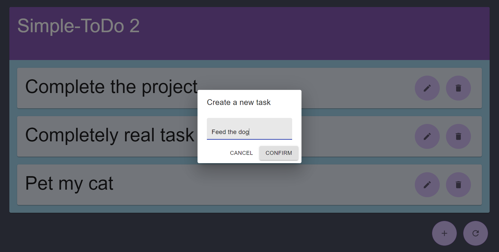

# Simple-Todo v2

A simple app to keep track of tasks you need to do!

## Motivation

This project serves as my first full stack webapp :)

## Screenshots

## Software used

### Front End

- React (via create-react-app)
- Axios (for RESTful API calls)
- Material-UI

### Back End

- Express
- Mikro-ORM
- PostgreSQL

## How to use

To start the server, install the required packages using `yarn install` or `npm install`. Then, navigate into the `server` subfolder and execute `yarn serve` (`npm run serve` if yarn isn't your thing).
The front end can be served locally by using the classic `yarn start` (or `npm start`) under the `webapp` directory. Note that you also have to install the required packages using `yarn install` or `npm install`.
